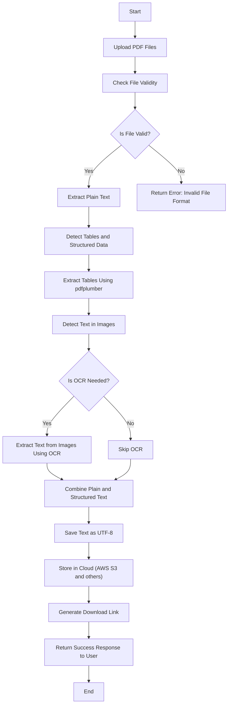

# PDF-to-Text Conversion Tool

## Overview

This is a Flask-based application that converts large volumes of PDF files into UTF-8 encoded text files. It handles complex data structures, including text, tables, and text within images, ensuring high accuracy for use in custom LLM training. The app supports batch processing, OCR for images, and cloud storage integration.

## Features

- **PDF to UTF-8 Text Conversion**: Accurately extracts text from PDFs, including handling structured data like tables.
- **OCR for Images**: Extracts text embedded in images within the PDF using Optical Character Recognition (OCR).
- **Batch Processing**: Supports the upload and conversion of multiple PDF files simultaneously.
- **Cloud Storage Integration**: Uploads converted text files to cloud storage (AWS S3, Google Cloud, etc.) and provides download links.
- **REST API**: Simple and intuitive API endpoints for uploading PDFs, checking conversion status, and downloading results.

## Process Flow



## Installation

### Prerequisites

- Python 3.10.0
- Virtualenv

### Setup

1. **Clone the repository**:
    ```bash
    git clone https://github.com/betaways01/PDFer.git
    cd PDFer
    ```

2. **Create a virtual environment**:
    ```bash
    python3 -m venv pdfer
    source venv/bin/activate  # On Windows use `venv\Scripts\activate`
    ```

3. **Install dependencies**:
    ```bash
    pip install -r requirements.txt
    ```

4. **Set up environment variables**:
    Create a `.env` file in the root directory and add your environment-specific variables, such as cloud storage credentials.

    Example:
    ```
    AWS_ACCESS_KEY_ID=your_aws_access_key
    AWS_SECRET_ACCESS_KEY=your_aws_secret_key
    ```

5. **Run the application**:
    ```bash
    python run.py
    ```

6. **Access the app**:
    Open your browser and go to `http://127.0.0.1:5000/`.

## API Endpoints

### 1. Upload PDF Files
- **Endpoint**: `/upload`
- **Method**: `POST`
- **Description**: Upload one or more PDF files for conversion.

### 2. Check Status
- **Endpoint**: `/status/<job_id>`
- **Method**: `GET`
- **Description**: Check the conversion status of a specific job.

### 3. Download Converted File
- **Endpoint**: `/download/<file_id>`
- **Method**: `GET`
- **Description**: Download the converted text file.

## Deployment

To deploy this application, you can use platforms like AWS EC2, Heroku, or Google Cloud. Ensure that the environment variables and cloud storage configurations are correctly set up in the deployment environment.

## License

This project is licensed under the MIT License. See the [LICENSE](LICENSE) file for details.

## Acknowledgments

- **Flask**: For providing a simple and flexible web framework.
- **PyMuPDF, pdfplumber, Tesseract**: For enabling accurate text and image processing from PDFs.

## Contact

For any issues, questions, or suggestions, feel free to reach out at <betaways01@gmail.com>.
